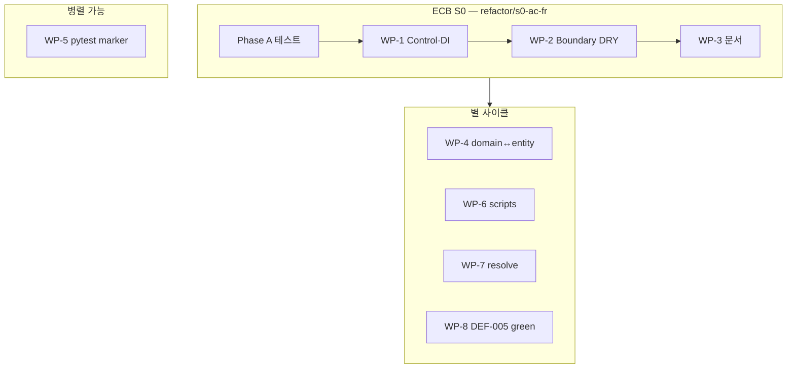
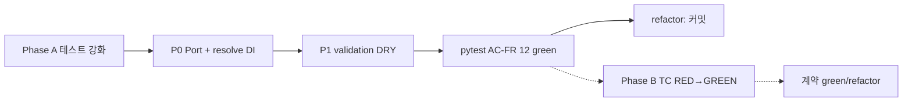

# Magic Square 4×4 — REFACTOR 계획 보고서 (S0 · AC-FR-01-01)

| 항목 | 내용 |
|------|------|
| **프로젝트명** | MagicSquare_XX |
| **문서 유형** | REFACTOR 단계 실행 계획 (SSOT) |
| **작성 기준일** | 2026-05-29 |
| **TDD Phase** | `refactor` — **미착수** (본 문서는 계획만; 코드 변경 없음) |
| **전제 GREEN** | AC-FR-01-01 12/12 passed ([Report/12](12.MagicSquare_RED_GREEN_Todo_Checklist_Report.md) §3.2) |
| **상위 문서** | [02](02.MagicSquare_TDD_Design_Report.md) §6 REFACTOR DoD, [11](11.MagicSquare_GREEN_Stabilize_AC_FR_01_01_Report.md), [12](12.MagicSquare_RED_GREEN_Todo_Checklist_Report.md) |
| **규칙 SSOT** | `.cursor/rules/magicsquare-tdd-testing.mdc`, `magicsquare-ecb-architecture.mdc` |
| **대화 Transcript** | [Prompting/12](../Prompting/12.cursor_refactor_plan_export_transcript.md) |

---

## 0. Executive Summary

본 문서는 **ECB 판정 트랙**(`magicsquare.boundary` / `magicsquare.control`)의 **Slice S0(AC-FR-01-01)** 에 대한 REFACTOR 실행 계획이다.  
코드 리뷰·테스트 매핑·REFACTOR phase 기준(Report/02 §6.1) 분석을 바탕으로 작성했으며, **구현·리팩터 커밋은 아직 수행하지 않는다.**

| 구분 | 상태 |
|------|------|
| AC-FR-01-01 pytest | ✅ 12 passed (G-01~G-04) |
| Dual-Track Skeleton | ❌ 24 failed (`pytest.fail`) — ECB refactor **선행 조건 아님** |
| REFACTOR 브랜치 | ⏳ `refactor/s0-ac-fr` 등 생성·실행 대기 |
| DEF-005 (`INVALID_SIZE` vs `InputError`) | ⏳ 문서 합의 전 — Phase B에서 별도 `green` |

**REFACTOR DoD (Report/02):** 해당 Slice TC 전부 녹색 유지 · **행위 변경 없음** · merge는 `green` 또는 `refactor`만.

---

## 1. 리팩토링 대상 목록 (우선순위 순)

| 순번 | 대상 파일 | 문제 | 적용 기법 | 우선순위 |
|------|-----------|------|-----------|----------|
| 1 | `src/magicsquare/control/orchestrator.py` | `control → boundary` 직접 import (`validate_grid_input`) — ECB 의존 방향 위반 | **Port/Adapter(의존성 역전)**: Boundary 검증을 `Callable`/`Protocol`로 주입; Application 경계에서만 `boundary → control` 조립 | **P0** |
| 2 | `src/magicsquare/control/orchestrator.py` | `resolve` 인자 선언만 되고 미사용 — green 후 회귀 방지 불가 | **의존성 주입 + 기본값**: `resolve = resolve or default_resolve`; 입력 거부 시 미호출 보장 | **P0** |
| 3 | `src/magicsquare/boundary/validation.py` | `INVALID_SIZE` 반환 블록 4회 중복 | **Extract Method / Factory**: `_invalid_size_failure()` 단일 출처 | **P1** |
| 4 | `src/magicsquare/boundary/validation.py` | `_INVALID_SIZE_*` 상수·PRD 코드(`INPUT_DIMENSION_MISMATCH`) 이중 계약 (DEF-005) | **상수 레지스트리 이동** — S0 REFACTOR에서는 구조만; 계약 변경은 Phase B | **P1** |
| 5 | `src/magicsquare/boundary/validation.py` | `isinstance(grid, list)`·`NotImplementedError` 분기 산재 | **파이프라인 스켈레톤**: parse → dimension → completeness (행위 동일) | **P2** |
| 6 | `src/magicsquare/domain/` ↔ `entity/` | 문서·규칙은 Entity, 코드는 `domain`; `entity/user.py`는 마방진 무관 | **Rename/Move** 또는 규칙 정렬; `user.py` 예제 분리 | **P2** |
| 7 | `src/magicsquare/domain/resolver.py` | `resolve()` RED 스텁, Control 미연동 | **Strangler** — S2~S4 GREEN 후 연동; REFACTOR는 시그니처·import만 | **P3** |
| 8 | `tests/unit/boundary/test_ac_fr_01_01_invalid_size.py` | `resolve` 스파이가 patch 경로 기준인데 오케스트레이터는 주입 미사용 | **테스트 더블 정렬**: 주입 `resolve` 기준 assert | **P0** |
| 9 | `defect_list.md`, `README.md` | AC-FR 12 passed vs defect_list stale | **문서 동기화** | **P1** |
| 10 | `pytest.ini` / CI | 전체 `pytest` 시 Skeleton 24 failed | **Marker 분리** (`dual_track_red`) | **P2** |
| 11 | `scripts/demo_solver.py` | `MAGIC_CONSTANT=34` 하드코딩 | **Profile 공유** (S1 GREEN 이후) | **P3** |
| 12 | `scripts/green_validation_gui.py` | `NotImplementedError` 삼킴 → Boundary 우회 | **데모 전용 경로 분리** | **P3** |

### 범위 밖 (본 REFACTOR 브랜치에서 금지)

- Dual-Track Skeleton 24건: `pytest.fail` 제거만으로 GREEN
- Dual-Track `InputValidator`를 ECB `magicsquare.boundary`에 혼입
- `ValidationFailure` → `VerdictResult` / `InputError` (DEF-005) — Phase B TC RED→GREEN 선행

### 1.1 리팩토링 작업 묶음 (Work Packages)

유사·동시 착수 가능 항목을 **한 번의 `refactor:` 커밋(또는 PR)** 단위로 묶었다.  
**권장 순서:** WP-1 → WP-2 → WP-3 (ECB S0) · WP-4~WP-7은 별 트랙·별 사이클.

| 묶음 ID | 이름 | 포함 순번 | 대상 | 같이 하는 이유 | 선행 조건 | 검증 |
|---------|------|-----------|------|----------------|-----------|------|
| **WP-1** | Control 경계·DI | 8 → 1 → 2 | `orchestrator.py`, `test_ac_fr_01_01_*.py` | ECB 의존 역전·`resolve` 주입·격리 테스트가 **한 진입점**(`verify_magic_square`) | Phase A 테스트 강화 | AC-FR 12 passed |
| **WP-2** | Boundary 내부 정리 | 3 → 4 → 5 | `validation.py` | 동일 파일·동일 DTO(`ValidationFailure`)·**행위 동일** DRY·상수·파이프라인 | **WP-1 완료** (Control이 Boundary 호출 방식 확정 후) | AC-FR 12 passed |
| **WP-3** | 문서 SSOT | 9 | `defect_list.md`, `README.md` | 코드 리팩터와 무관·산출물 정합만 | AC-FR 12 green 사실 확정 | diff·체크리스트 |
| **WP-4** | 패키지·레이어 명명 | 6 | `domain/` ↔ `entity/`, `user.py` | **Rename/Move**는 import 전역 영향·마방진 Entity 도입 시 한꺼번에 | WP-1·2 또는 S1 Entity 스텁 착수 시 | `tests/unit/` + 규칙 문서 |
| **WP-5** | pytest·CI 분리 | 10 | `pytest.ini`, CI 설정 | 인프라만 변경·프로덕션 무관 | 없음 (ECB와 병렬 가능) | `pytest tests/unit/` green; skeleton은 `-m "not dual_track_red"` |
| **WP-6** | Track B 스크립트 | 11 → 12 | `demo_solver.py`, `green_validation_gui.py` | 솔버·GUI·Profile **공유 커널**·데모 경로 | S1 Profile **green** | `-m golden_master` |
| **WP-7** | Domain 연동 | 7 | `domain/resolver.py`, Control 호출부 | `resolve` 실구현·오케스트레이션은 **Slice S2~S4** | TC-001~017 **green** | Slice TC 전부 |
| **WP-8** | 계약 전환 (REFACTOR 아님) | (DEF-005) | DTO·코드명·TP/PRD | `INVALID_SIZE` → `InputError`는 **breaking change** | Phase B `test_tc008_*` 등 **green** | TC-008~011,016 |



#### WP-1 상세 (한 커밋에 넣을 작업)

| 순서 | 작업 | 파일 |
|------|------|------|
| 1 | `resolve` 주입 assert를 **파라미터 스파이** 기준으로 수정 | `test_ac_fr_01_01_invalid_size.py` |
| 2 | `validate_grid_input`을 **주입 Callable**로 교체 (직접 import 제거) | `orchestrator.py` |
| 3 | 거부 경로에서 `resolve` 미호출; (스텁) 성공 경로만 `resolve` 호출 준비 | `orchestrator.py` |

#### WP-2 상세 (한 커밋)

| 순서 | 작업 | 파일 |
|------|------|------|
| 1 | `_invalid_size_failure()` 추출 | `validation.py` |
| 2 | 상수를 모듈 상단·단일 블록으로 정리 (코드명 변경 없음) | `validation.py` |
| 3 | `parse → dimension` private 함수 분리 (`NotImplementedError` 위치 동일) | `validation.py` |

#### 같이 하면 안 되는 조합

| 조합 | 이유 |
|------|------|
| WP-2 + WP-8 | 계약·코드명 변경은 `green` 단계 |
| WP-1 + WP-4 | Rename이 Port/DI diff와 섞이면 리뷰·회귀 어려움 |
| WP-1 + WP-6 | ECB Control과 Track B scripts 책임 혼선 |
| WP-2 + Dual-Track Skeleton GREEN | 트랙·모듈 분리 (Report/12) |

---

## 2. 테스트 선행 필요 항목

### 2.1 Phase A — P0/P1 구조 리팩터 직전 (AC-FR 12건 녹색 유지)

| 함수 / 진입점 | 선행 테스트 | 이유 |
|---------------|-------------|------|
| `verify_magic_square(..., resolve=...)` | 주입 `resolve` 기준 `assert_not_called` / (향후) `assert_called_once` | Port 분리·`resolve` 연동 회귀 |
| `verify_magic_square` | Boundary 스텁 주입 시 validate만·Domain 미호출 | `control → boundary` 제거 후 Control 단위 검증 |
| `validate_grid_input` | (선택) `tests/unit/boundary/test_validate_grid_input.py` — AC-FR과 동일 Given/Then | 오케스트레이터·Boundary 책임 분리 |

### 2.2 Phase B — 계약·DTO 리팩터 직전 (DEF-005 · S0/S4)

| 함수 | 선행 테스트 | TC-ID |
|------|-------------|-------|
| `validate_grid_input` / `verify_magic_square` | `test_tc008_*` | TC-008 (3×3) |
| 동일 | `test_tc016_*` | TC-016 (4×5) |
| 동일 | `test_tc009_*` | TC-009 (null 셀) |
| 동일 | `test_tc010_*` | TC-010 (실수) |
| 완전 4×4 경로 | canonical 16-tuple·완전성 | TC-011 확장 / S4 |

> Phase B 없이 DTO/코드명 변경은 **breaking `green`** 이며 REFACTOR가 아님.

### 2.3 Phase C — Slice S1~S4 (별 사이클)

| 함수 | 선행 테스트 |
|------|-------------|
| `resolve` | TC-001~017 (`test_tc001_*` …) |
| Profile / I-1 / I-2·I-3 | Report/02 Slice S1~S3 TC |
| 통합 | `tests/integration/` 1건 권장 |

### 2.4 Dual-Track (ECB refactor와 분리)

Skeleton 24건: **Full RED(assert) → GREEN → REFACTOR**. ECB `refactor` 선행 조건 **아님**.

---

## 3. `src/` 파일 ↔ 테스트 매핑 (참고)

| 프로덕션 파일 | 대응 `test_*.py` | 비고 |
|---------------|------------------|------|
| `boundary/validation.py` | `tests/unit/boundary/test_ac_fr_01_01_invalid_size.py` | ✅ AC-FR 12 |
| `control/orchestrator.py` | 동일 | ✅ 위임·None 경로 |
| `domain/resolver.py` | 전용 없음 (미호출만 검증) | ⚠️ Phase C |
| `entity/user.py` | `tests/unit/entity/test_user_entity.py` | 스캐폴드 |
| (미구현) Entity 판정 | TC-001~018 RED 미착수 | Report/12 §2.4 |

---

## 4. 리팩토링 후 검증 방법

### 4.1 회귀 테스트 (필수 게이트)

```powershell
cd c:\DEV\MagicSquare_XX
python -m pytest tests/unit/boundary/test_ac_fr_01_01_invalid_size.py -v
```

**기대:** `12 passed`, `0 failed`

**권장 추가:**

```powershell
python -m pytest tests/unit/ -v
python -m pytest -m golden_master -v
```

**전체 스위트 (참고 — Skeleton 24 failed 예상):**

```powershell
python -m pytest -v
```

**커버리지 (선택):**

```powershell
.\scripts\run-coverage.ps1
```

### 4.2 외부 동작 불변 확인

1. 동일 `grid` → 동일 `ValidationFailure.code` / `message` (`INVALID_SIZE`, `Grid must be 4x4.`)
2. `test_scope_only_invalid_size_not_other_ac_codes` 유지
3. 입력 거부 시 `resolve` **0회**
4. 완전 4×4 형태 입력 → 여전히 `NotImplementedError` (S0 범위 밖 기능 미추가)
5. assert 완화·`skip`/`xfail` 없음; Dual-Track `src/` 혼입 없음
6. `defect_list.md` · Report/11 후속 스냅샷 갱신

---

## 5. 권장 실행 순서



| 단계 | 브랜치·커밋 | 산출 |
|------|-------------|------|
| 0 | `develop` / `stabilize/green` | AC-FR 12 green 확인 |
| 1 | `refactor/s0-ac-fr` | Phase A 테스트 |
| 2 | `refactor:` | P0 → P1 코드 |
| 3 | `refactor:` | 문서·defect_list |
| 4 | (별도) `red` → `green` | TC-008+ · DEF-005 |

---

## 6. Artifact Index

| 산출물 | 경로 |
|--------|------|
| 본 계획 | `Report/16.MagicSquare_REFACTOR_Plan_Report.md` |
| Transcript | [Prompting/12](../Prompting/12.cursor_refactor_plan_export_transcript.md) |
| GREEN SSOT | [Report/12](12.MagicSquare_RED_GREEN_Todo_Checklist_Report.md) |
| TDD Playbook | [Report/02](02.MagicSquare_TDD_Design_Report.md) §6 |
| 구현 대상 | `src/magicsquare/boundary/validation.py`, `control/orchestrator.py` |
| 회귀 테스트 | `tests/unit/boundary/test_ac_fr_01_01_invalid_size.py` |

---

*본 문서는 REFACTOR **계획** SSOT이다. `refactor:` 커밋 적용 후 §0·§4 pytest 스냅샷을 갱신한다.*
